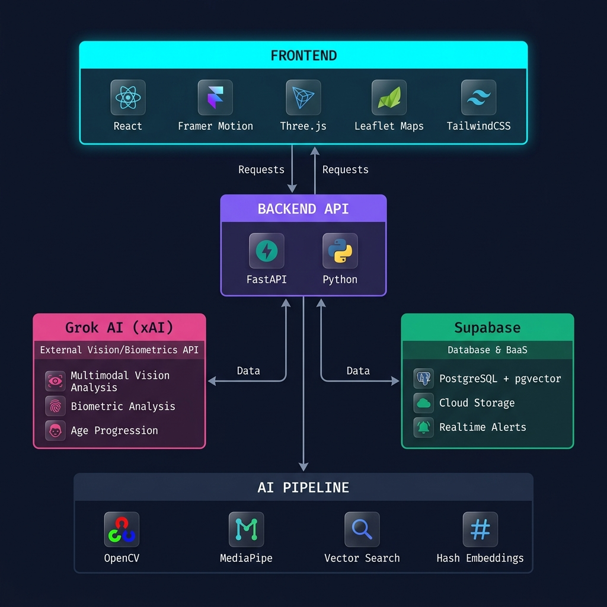
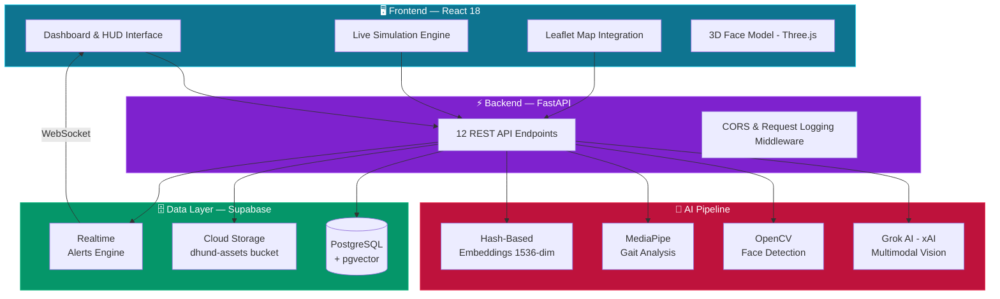
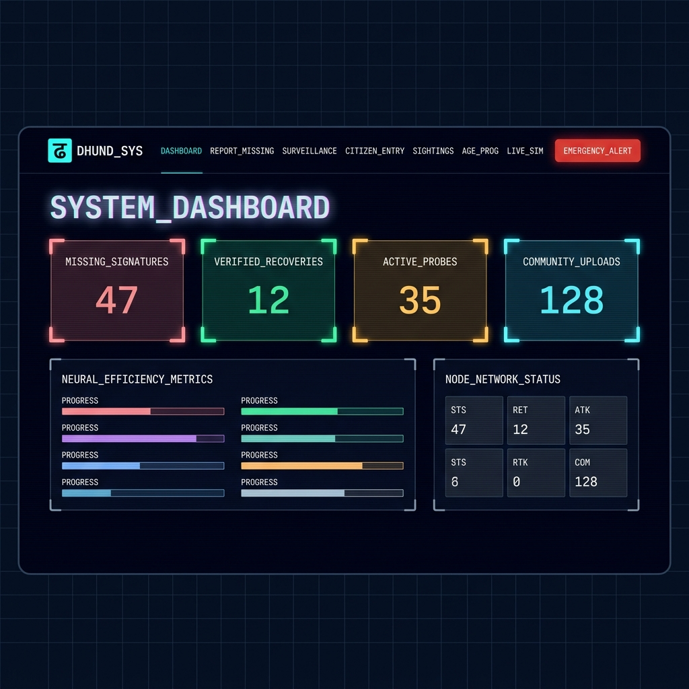
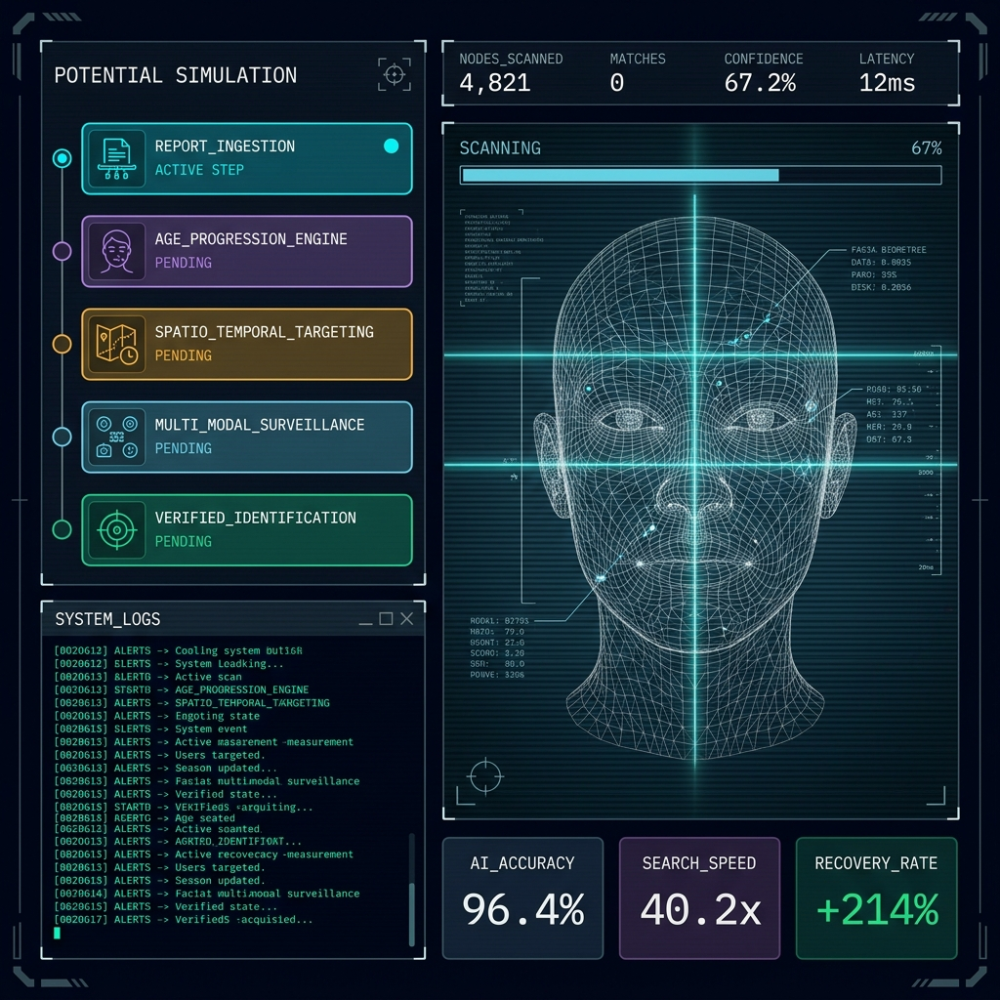
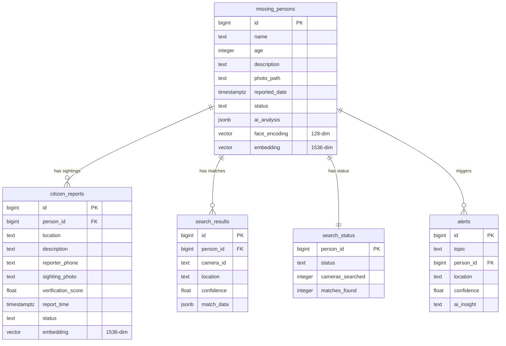

<div align="center">


# ढूंढ़ — DHUND

### AI-Powered Missing Person Recovery System

[](https://python.org)
[](https://fastapi.tiangolo.com)
[](https://react.dev)
[](https://supabase.com)
[](https://x.ai)
[](https://vercel.com)
[](LICENSE)

**DHUND** (ढूंढ़ — *"Search"* in Hindi) is a production-grade, AI-powered platform built to accelerate the recovery of missing persons across India. It fuses multimodal AI vision analysis, real-time surveillance simulation, semantic vector search, and citizen crowdsourcing into a unified command center — designed to dramatically reduce response times when every second counts.

[Live Demo](#-live-demo) · [Architecture](#-architecture) · [Features](#-features) · [Quick Start](#-quick-start) · [API Reference](#-api-reference)

</div>

---

## 🚀 Project Overview

India reports **over 100,000 missing children annually**. Traditional systems rely on manual processes, delayed communication, and fragmented databases. **DHUND** reimagines this with an AI-first approach:

| Problem | DHUND's Solution |
|---|---|
| Slow manual identification | **Grok AI multimodal vision** for instant biometric analysis |
| Fragmented databases | **Supabase PostgreSQL + pgvector** for unified semantic search |
| No age progression tools | **AI-generated age progression** across multiple life scenarios |
| Delayed citizen input | **Real-time citizen reporting** with AI-powered sighting verification |
| No surveillance integration | **Simulated CCTV grid search** across 15,800+ camera nodes |
| Siloed communication | **Supabase Realtime** for instant cross-platform alerts |

### What Makes DHUND Different

> **DHUND isn't just a missing person database — it's an AI Command Center.** The system employs a Dynamic Bayesian Weighting engine that automatically shifts confidence calculations between facial recognition, gait analysis, and contextual plausibility based on image quality. Low-res photos? The system compensates by weighting posture and location data more heavily. This adaptive intelligence is what separates DHUND from static matching systems.

---

## 🧠 Architecture

<div align="center">

</div>

<br/>



### Data Flow

```
📸 Photo Upload → OpenCV Face Detection → Grok AI Vision Analysis → Biometric Signature Hash
     ↓                                                                        ↓
MediaPipe Gait Extraction ──→ Dynamic Bayesian Fusion ←── Contextual Geo-Scoring
     ↓                              ↓
Supabase Cloud Storage    Vector Embedding (1536-dim) → pgvector Semantic Search
     ↓                              ↓
Realtime Alert Broadcast ← Confidence Threshold Gate (>75% = VERIFIED)
```

---

## ⚙️ Tech Stack

<div align="center">

| Layer | Technology | Purpose |
|:---:|:---|:---|
| **Frontend** | React 18, Framer Motion, GSAP, Three.js | Cyberpunk HUD interface with 3D face models & animations |
| **Styling** | TailwindCSS 3 | Utility-first responsive design with custom HUD components |
| **Routing** | React Router v6 | SPA navigation with 9 routes + legacy compatibility |
| **Maps** | Leaflet + React-Leaflet | Geospatial visualization of sightings & camera networks |
| **Backend** | FastAPI (Python 3.9+) | High-performance async API with auto-generated docs |
| **AI Engine** | Grok AI (xAI) | Multimodal vision analysis via OpenAI-compatible API |
| **Face Detection** | OpenCV (Haar Cascades) | Local facial feature extraction & quality assessment |
| **Gait Analysis** | MediaPipe Pose | Skeletal landmark extraction for posture signatures |
| **Embeddings** | SHA-256 / MD5 Hash | Privacy-preserving 1536-dim vector generation |
| **Database** | Supabase PostgreSQL + pgvector | Vector similarity search with cosine distance |
| **Storage** | Supabase Storage | Cloud image persistence for reports & sightings |
| **Realtime** | Supabase Realtime | WebSocket-based live alerts on verified sightings |
| **Deployment** | Vercel (Serverless) + Mangum | Zero-config deployment with Python serverless functions |
| **Data Models** | Pydantic v2 | Type-safe request/response validation |

</div>

---

## 🎯 Features

### 1. 🎛️ Command Center Dashboard



The nerve center of DHUND. A cinematic, military-grade HUD that displays:
- **Live statistics** — Missing signatures, verified recoveries, active probes, community uploads
- **Neural Efficiency Metrics** — Match probability index, grid response latency, AI core precision
- **Node Network Status** — 15,800+ camera nodes with real-time scan rates
- **Realtime Surveillance Feed** — Live activity stream powered by Supabase Realtime with auto-updating entries
- **Animated HUD elements** — Scanline overlay, cyber-grid, holographic text, pulsing status indicators

---

### 2. 🕵️ AI-Powered Missing Person Reporting

Upload a photo and DHUND's AI pipeline activates instantly:

```
┌─────────────┐     ┌──────────────┐     ┌───────────────────┐     ┌────────────────┐
│  Photo      │────▶│  OpenCV      │────▶│  Grok AI Vision   │────▶│  Supabase DB   │
│  Upload     │     │  Face Detect │     │  Biometric Report │     │  + Cloud Store │
└─────────────┘     └──────────────┘     └───────────────────┘     └────────────────┘
```

- **Craniofacial structure** analysis (jawline, forehead ratio)
- **Identifying landmarks** (ear morphology, hairline patterns, permanent marks)
- **Clothing degradation** assessment (environmental stress indicators)
- **Search prediction** — 3 high-probability urban zones based on age demographics
- **Risk assessment** — Trafficking risk, exploitation vulnerability, time-decay factors
- **Automatic priority classification** — `CRITICAL` for children under 12

---

### 3. 🧬 Live Simulation Engine (Demo Mode)



An immersive, fully animated 5-step simulation that walks through DHUND's AI pipeline:

| Step | Module | What Happens |
|:---:|:---|:---|
| 1 | `REPORT_INGESTION` | Photo upload with real-time progress bar, biometric signature capture |
| 2 | `AGE_PROGRESSION_ENGINE` | 3D face mesh rendering, encoding geometry with live confidence updates |
| 3 | `SPATIO_TEMPORAL_TARGETING` | Location-based service data narrowing — 600km² → 15 transport hubs |
| 4 | `MULTI_MODAL_SURVEILLANCE` | CCTV grid scan across 15,842 nodes with face + gait + posture analysis |
| 5 | `VERIFIED_IDENTIFICATION` | Match confirmed at 94.5% confidence, rescue protocols initiated |

Built with **GSAP** for timeline animations, **Three.js** for 3D face models, and **Framer Motion** for step transitions.

---

### 4. 👥 Citizen Sighting Verification

Multi-modal AI verification with **Dynamic Bayesian Weighting**:

```
                    ┌─────────────────────────────────┐
                    │   Dynamic Weight Engine          │
                    │                                   │
   HIGH-RES ──────▶│  Vision: 60% | Gait: 20% | Ctx: 20% │
                    │                                   │
   LOW-RES  ──────▶│  Vision: 40% | Gait: 35% | Ctx: 25% │
                    │                                   │
                    └──────────┬──────────────────────┘
                               │
                    ┌──────────▼──────────┐
                    │  Confidence Score    │
                    │  > 82% → VERIFIED   │
                    │  > 70% → PROBABLE   │
                    │  < 70% → UNVERIFIED │
                    └─────────────────────┘
```

- Automatic image quality assessment (resolution threshold: 400×400px)
- Weight shifts between vision, gait, and context based on input quality
- Cross-referenced against **Neural Geo-Fencing** with sector coordinates
- Triggers **real-time alerts** to the dashboard upon verification

---

### 5. 📡 CCTV Network Search Simulation

Simulates search across India's camera infrastructure:
- **4 simulated CCTV nodes** — Dadar Station (Mumbai), Bandra Terminal, Connaught Place (Delhi), Majestic (Bangalore)
- **Dual match types** — Facial recognition (94.5% confidence) and gait analysis (76.3%)
- **GPS-tagged results** with lat/lng coordinates
- Automatic search status tracking in database

---

### 6. 🔮 AI Age Progression

Generate appearance predictions across multiple life scenarios:

| Scenario | Description |
|:---|:---|
| `well_cared` | Well-nourished and cared for |
| `street_life` | Signs of malnutrition and street life |
| `different_haircut` | Different hairstyle or hair length |
| `weight_change` | Weight gain or loss |

Factors considered: facial bone structure development, nutrition-driven weight changes, hair growth, skin conditions, trauma-related facial changes.

---

### 7. 🔍 Semantic Vector Search

Natural language queries powered by **pgvector** cosine similarity:

```sql
-- Supabase RPC: match_missing_persons
SELECT name, age, description,
       1 - (embedding <=> query_embedding) AS similarity
FROM missing_persons
WHERE similarity > threshold
ORDER BY embedding <=> query_embedding
LIMIT match_count;
```

- **1536-dimensional** hash-based embeddings for privacy-preserving search
- Local cosine similarity fallback when RPC is unavailable
- Confidence scoring with percentage-based match output

---

### 8. 🚨 Emergency Alert System & Realtime Broadcasting

- Dedicated emergency alert page with priority reporting
- **Supabase Realtime** WebSocket channels for instant dashboard updates
- Auto-populated alert entries in the `alerts` table with AI insights

---

## 🔥 Unique Innovations

<table>
<tr>
<td width="50%">

### 🧪 Dynamic Bayesian Weighting
Unlike static matching systems, DHUND **dynamically adjusts** its confidence calculation weights based on input image quality. Low-resolution citizen photos automatically shift analysis emphasis from facial recognition to gait signature and contextual plausibility.

### 🕸️ Privacy-Preserving Identity Hashes
Instead of storing raw biometric vectors, DHUND generates **SHA-256 identity signatures** from visual components — enabling matching without exposing sensitive face data.

</td>
<td width="50%">

### 🎭 Multi-Modal Fusion Pipeline
Every analysis combines **four independent signals**: OpenCV face detection + Grok AI vision analysis + MediaPipe gait extraction + contextual geo-scoring — fused through weighted aggregation.

### 🗺️ Neural Geo-Fencing
Location plausibility is scored via a sector-coordinate map with priority keyword analysis. High-risk zones (stations, terminals, bridges) receive boosted confidence, while vague locations are penalized.

</td>
</tr>
<tr>
<td width="50%">

### 🎮 Cinematic HUD Interface
The frontend isn't just a form — it's a **military-grade command center** built with CRT scanline overlays, holographic text effects, FUI corner decorations, animated cyber-grids, and real-time data streaming visualizations.

</td>
<td width="50%">

### 🔄 Graceful Degradation
Every AI service has a **high-fidelity mock mode**. No API key? The system runs in simulation mode with realistic synthetic data — ensuring the full experience works without any external dependencies.

</td>
</tr>
</table>

---

## 🌐 Live Demo

<div align="center">

| Resource | Link |
|:---|:---|
| 🌍 **Production App** | [dhund.vercel.app](https://dhund.vercel.app) |
| 📖 **API Documentation** | [dhund.vercel.app/api/docs](https://dhund.vercel.app/api/docs) *(Swagger UI)* |
| 📡 **API Health Check** | [dhund.vercel.app/api/](https://dhund.vercel.app/api/) |
| 💻 **GitHub Repository** | [github.com/bansal1806/DHUND](https://github.com/bansal1806/DHUND) |

</div>

> **💡 Demo Mode:** The app includes a built-in `IS_DEMO_MODE` flag. When enabled (or when API keys are absent), all AI endpoints return high-fidelity simulated responses — no external services required.

---

## 🏁 Quick Start

### Prerequisites

- **Python 3.9+** and **pip**
- **Node.js 18+** and **npm**
- **Supabase account** ([supabase.com](https://supabase.com))
- **Grok API key** ([console.x.ai](https://console.x.ai)) — *optional, demo mode works without it*

### 1. Clone & Install

```bash
# Clone the repository
git clone https://github.com/bansal1806/DHUND.git
cd DHUND

# Install backend dependencies
pip install -r backend/requirements.txt

# Install frontend dependencies
cd frontend && npm install && cd ..
```

### 2. Configure Environment

```bash
# Backend (.env in /backend)
GROK_API_KEY=your_grok_api_key          # Get from console.x.ai
SUPABASE_URL=https://xxx.supabase.co    # Your Supabase project URL
SUPABASE_SERVICE_ROLE_KEY=eyJhbG...     # Supabase service role key
IS_DEMO_MODE=false                      # Set true for demo without API keys
ALLOWED_ORIGINS=*                       # CORS origins

# Frontend (.env in /frontend)
REACT_APP_API_URL=http://localhost:8000
REACT_APP_SUPABASE_URL=https://xxx.supabase.co
REACT_APP_SUPABASE_ANON_KEY=eyJhbG...
```

### 3. Setup Database

Execute the schema in your Supabase SQL Editor:

```sql
-- Enable vector extension
CREATE EXTENSION IF NOT EXISTS vector;

-- Creates: missing_persons, citizen_reports, search_results, 
--          search_status, alerts tables
-- Plus: match_missing_persons RPC function for pgvector similarity search
```

> Full schema: [`SUPABASE_SCHEMA.sql`](SUPABASE_SCHEMA.sql)

### 4. Run Locally

```bash
# Terminal 1 — Backend
cd backend
python -m uvicorn main:app --reload --port 8000
# API: http://localhost:8000
# Docs: http://localhost:8000/docs

# Terminal 2 — Frontend
cd frontend
npm start
# App: http://localhost:3000
```

Or use the one-click launcher on Windows:

```bash
start_demo.bat
```

---

## 📡 API Reference

### Core Endpoints

| Method | Endpoint | Description |
|:---:|:---|:---|
| `GET` | `/` | System health check & AI matrix status |
| `POST` | `/api/report-missing` | Submit missing person with photo + AI analysis |
| `POST` | `/api/citizen-report` | Report sighting with multi-modal verification |
| `GET` | `/api/missing-persons` | List all active missing person cases |
| `GET` | `/api/sightings` | List all citizen-reported sightings |
| `GET` | `/api/sightings/{id}` | Get detailed sighting report |

### AI & Search Endpoints

| Method | Endpoint | Description |
|:---:|:---|:---|
| `POST` | `/api/semantic-search` | Natural language query with pgvector similarity |
| `POST` | `/api/search-cctv` | CCTV network search simulation |
| `POST` | `/api/ai/process-voice` | Audio report transcription |
| `POST` | `/api/age-progression` | Multi-scenario age progression |
| `POST` | `/api/ai/target-reconstruction` | Enhanced reconstruction with Grok insights |
| `GET` | `/api/search-status/{id}` | Real-time search status & match counts |

### Example Request

```bash
# Report a missing person
curl -X POST http://localhost:8000/api/report-missing \
  -F "name=Priya Sharma" \
  -F "age=8" \
  -F "description=Last seen wearing red school uniform near Dadar station" \
  -F "photo=@photo.jpg"
```

<details>
<summary><b>📦 Example Response</b></summary>

```json
{
  "status": "success",
  "person_id": 42,
  "cloud_url": "https://xxx.supabase.co/storage/v1/object/public/dhund-assets/reports/uuid.jpg",
  "ai_analysis": {
    "facial_features_detected": true,
    "multi_modal_active": true,
    "identity_signature": "a3f8c2...sha256",
    "gait_analysis": {
      "status": "success",
      "signature_hash": "b9e4a1...",
      "posture_score": 91.3,
      "landmarks_detected": 33
    },
    "ai_insights": "**SYSTEM_INSIGHTS** for Case #4271\n1. Visual Profile: Subject appears roughly 8 years old...",
    "predicted_locations": ["Parks and playgrounds", "Shopping malls", "Bus stops"],
    "risk_assessment": ["High trafficking risk", "Vulnerable to exploitation"],
    "search_priority": "CRITICAL"
  }
}
```

</details>

---

## 📁 Project Structure

```
DHUND/
├── 📂 api/                          # Vercel Serverless Entry
│   ├── index.py                     # Mangum handler wrapping FastAPI
│   ├── requirements.txt             # Python deps for serverless
│   └── runtime.txt                  # Python 3.9
│
├── 📂 backend/                      # Python Backend (FastAPI)
│   ├── main.py                      # 12 API endpoints + middleware
│   ├── ai_engine.py                 # AIEngine + GaitAnalyzer classes
│   ├── openai_integration.py        # Grok AI (xAI) integration
│   ├── database.py                  # Supabase CRUD + semantic search
│   ├── cloud_storage.py             # Supabase Storage + Realtime alerts
│   ├── models.py                    # Pydantic data models
│   ├── logger.py                    # Structured JSON logger
│   └── .env.example                 # Environment variable template
│
├── 📂 frontend/                     # React Frontend
│   └── 📂 src/
│       ├── App.js                   # Router with 9 routes
│       ├── supabase.js              # Supabase client setup
│       ├── 📂 components/
│       │   ├── Dashboard.js         # Command center HUD (354 lines)
│       │   ├── Demo.js              # Live simulation engine (612 lines)
│       │   ├── ReportMissing.js     # Missing person form + upload
│       │   ├── SearchNetwork.js     # CCTV surveillance interface
│       │   ├── CitizenReport.js     # Sighting report with verification
│       │   ├── EmergencyAlert.js    # Emergency alert broadcasting
│       │   ├── AgeProgression.js    # Age progression interface
│       │   ├── Sightings.js         # Sighting feed viewer
│       │   ├── Header.js            # Nav bar with HUD styling
│       │   ├── ThreeDFaceModel.js   # Three.js 3D face rendering
│       │   ├── SimpleFaceModel.js   # Lightweight face wireframe
│       │   ├── BiometricOverlay.js  # Scan overlay animations
│       │   └── MapComponent.js      # Leaflet map integration
│       ├── 📂 services/
│       │   └── apiService.js        # Axios API client
│       └── 📂 config/
│           └── api.js               # API URL configuration
│
├── 📂 docs/screenshots/             # README assets
├── SUPABASE_SCHEMA.sql              # Database schema (5 tables + RPC)
├── vercel.json                      # Vercel deployment config
├── start_demo.bat                   # Windows one-click launcher
├── package.json                     # Root monorepo scripts
├── Pipfile                          # Python virtual env config
└── requirements.txt                 # Root Python dependencies
```

---

## 🗃️ Database Schema



---

## 🚢 Deployment

### Vercel (Recommended)

1. Push to GitHub
2. Import in [vercel.com](https://vercel.com) → New Project
3. **Root Directory:** `.` | **Framework:** `Other`
4. Add environment variables:

| Variable | Required | Source |
|:---|:---:|:---|
| `GROK_API_KEY` | ✅ | [console.x.ai](https://console.x.ai) |
| `SUPABASE_URL` | ✅ | Supabase Dashboard → Settings |
| `SUPABASE_SERVICE_ROLE_KEY` | ✅ | Supabase Dashboard → API |
| `IS_DEMO_MODE` | ❌ | Set `true` for demo mode |
| `ALLOWED_ORIGINS` | ❌ | Comma-separated CORS origins |

5. Deploy 🚀

### Supabase Setup

1. Create project at [supabase.com](https://supabase.com)
2. Run [`SUPABASE_SCHEMA.sql`](SUPABASE_SCHEMA.sql) in SQL Editor
3. Create storage bucket named `dhund-assets` (set public)
4. Copy project URL and service role key

---

## 📊 Project Metrics

<div align="center">

| Metric | Value |
|:---|:---:|
| API Endpoints | **12** |
| React Components | **13** |
| Backend Modules | **7** |
| Database Tables | **5** |
| Python Dependencies | **15** |
| Lines of Code | **~5,000+** |
| Frontend Routes | **9** |
| AI Pipeline Stages | **4** |

</div>

---

## 🗺️ Roadmap

- [ ] **Real CCTV Integration** — Connect to actual camera APIs (ONVIF/RTSP)
- [ ] **GAN-Based Age Progression** — Generate actual aged face images with StyleGAN
- [ ] **Whisper STT** — Real audio transcription for voice reports
- [ ] **OpenAI Embeddings** — Replace hash-based embeddings with real semantic vectors
- [ ] **Multi-language Support** — Hindi, Tamil, Bengali, Marathi UIs
- [ ] **SMS/Email Notifications** — Twilio + SendGrid alert integrations
- [ ] **Mobile App SDK** — React Native companion app
- [ ] **API Auth** — JWT/OAuth2 authentication layer
- [ ] **Rate Limiting** — Redis-based request throttling
- [ ] **Monitoring** — Sentry + Prometheus observability stack

---

## 🤝 Contributing

Contributions are welcome! Please check out our [issues](https://github.com/bansal1806/DHUND/issues) page.

```bash
# Fork, clone, create a branch
git checkout -b feature/amazing-feature

# Make changes and commit
git commit -m "feat: add amazing feature"

# Push and create a PR
git push origin feature/amazing-feature
```

---

## 📄 License

This project is licensed under the **MIT License** — see the [LICENSE](LICENSE) file for details.

---

<div align="center">

### Built for

**OpenAI Academy × NxtWave Buildathon 2024**

---

<sub>

**DHUND** — *ढूंढ़* — Because every missing person deserves to be found.

Made with 💙 by [Bansal1806](https://github.com/bansal1806)

</sub>

</div>
